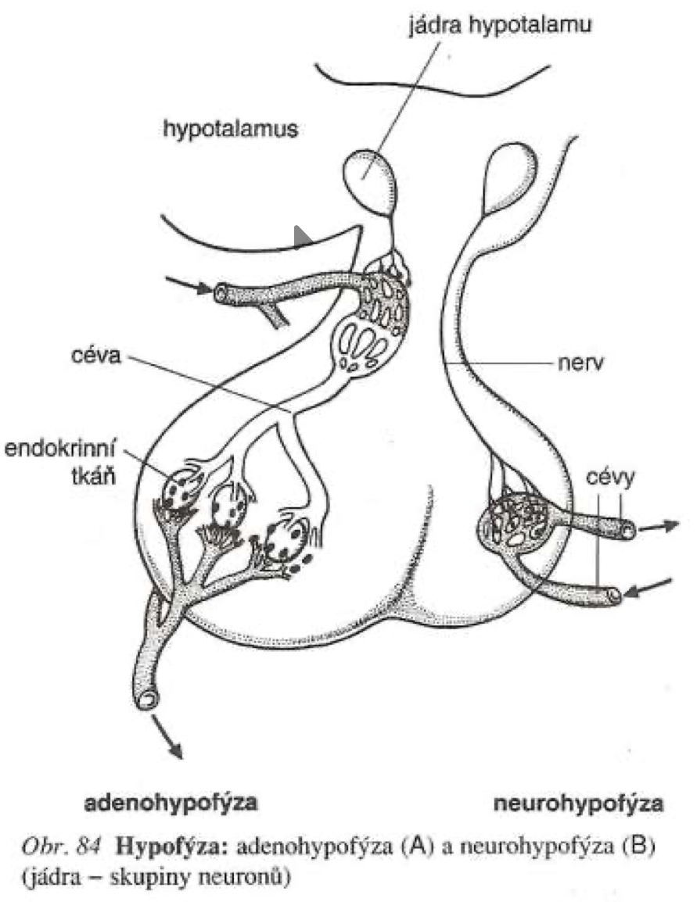

# Hypofýza (podvěsek mozkový)

- uložen v tureckém sedle klínové kosti v lebce
- spojen s mezimozkem (s hypotalamem)
- 2 části:
  1. přední lalok (adenohypofýza)
  2. zadní lalok (neurohypofýza)
- řídící endokrinní žláza - některé její hormony - *glandotropní* - ovlivňují činnost jinách endokrinních žláz

 

## Adenohypofýza

### Somatotropin (STH, růstový hormon)

- stimuluje syntézu bílkovin a růst dlouhých kostí (STH působí prostřednictvím jaterního hormonu *somatomedinu - tkáňový hormon*)
- nadbytek v dětství -> **gigantismus**
- nedostatek -> **nanismus** (trpasličí vzrůst)
- při zvýšené produkci STH v dospělosti -> **aktromegalie** (zvětšení koncových částí těla)

### Prolaktin (PRL)

- stimuluje růst mléčné žlázy, sekreci mléka (laktace) v těhotenství a po porodu
- jeho přebytek souvisí s nepoldností ženy, v období kojení je přebytek PRL -> snížená pravděpodobnost otěhotnění

### Hormony řídící činnost jiných endokrinních žláz

#### Tyreotropní hormon (TTH, Tyreotropin)

- řídí činnost štítné žlázy

#### Adrenokortikotropní hormon (ACTH, kortikotropin)

- stimuluje hormny kůry nadledvinek

### Gonadotropní hormony (ovlivňují pohlavní orgány)

#### Folitropin (FSH, folikuly stimulující hormon)

- u žen stimuluje růst folikulů ve vaječnících a tvorbu estrogenu
- u mužů stimuluje spermatogenezi

#### Lutropin (LH, luteinizační hormon)

- stimuluje ovulaci a růst žlutého tělíska
- u podporuje tvorbu pohlavních hormonů (u žen estrogen, progesteron; u mužů testosteron)
