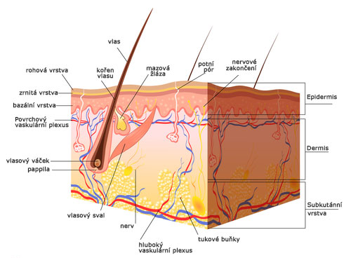

# Kůže

- největší orgán těla
- zhruba 8 % tělesné hmotnosti
- $1,8$ $m^2$

## Funkce

- ochranná
- termoregulace
- syntéza vitaminu D
- smyslové vnímání
- pokryv těla
- částečné dýchání
- vylučovací

## Struktura

### 1. povrchová pokožka (epidermis)

- několiv vrstev plochých buněk -> *rohovatění a odumírání nejsvrchnější vrstvy*, tvorba nových buněk na bázi epidermis
- vysoká schopnost regenerace
- pigmentové buňky = **melanocyty**
- pigment **melanin** -> zachycuje UV záření, zbarvení kůže
- obsahuje bílkovinu **keratin**

### 2. škára (dermis)

- vazivové buňky, bílkovinná vlákna **kolagenu a elastinu** -> pevnost a pružnost
- **nervy a cévy**
- **nervová zakončení** - různě hluboko (nejvíce dlaně)
- proti pokožce vysílá škára výběžky = papily -> papilární lišty (linie) $-$ jejich uspořádání je každého individuální $-$ využití v daktyloskopii ke zjišťování otisků prstů

#### Nervová zakončení

- termoreceptory
  - chlad, teplo
  - Ruffiniho tělíska (teplo)
  - Krauseovo tělísko (chlad)
- mechanoreceptory
  - Paciniho tělíska (dotyk, tlak)
  - Meissnereovo tělísko (lehký dotyk a vibrace $-$ prsty, rty)
- nociceptory
  - bolest
  - volná nervová zakončení

#### Vlasy a chlupy

- z vlastového váčku (folikulu)

#### Mazové žlázy

- ústí do folikulu

#### Maz

- chrání kůži a vlasy proti vysychání, lesku vlasů, také baktericidní účinky
- nejsou na dlaních a chodidlech

#### Potní žlázy

- hlavně dlaně, chodidla, podpaží, čelo
- $100$ $ml$ potu/den
- složení potu - voda, $NaCl$, močovina, kyslina močová, kyselina mléčná
- aktivace z hypotalamu (část mezimozku) - centrum termoregulace
