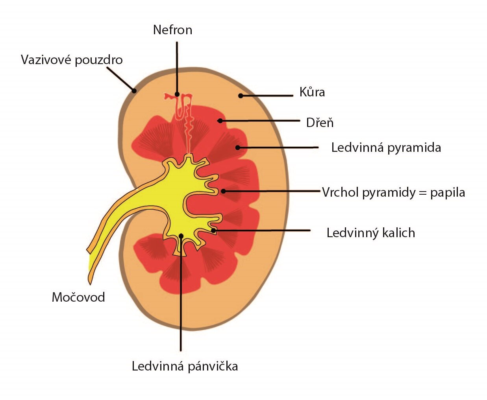
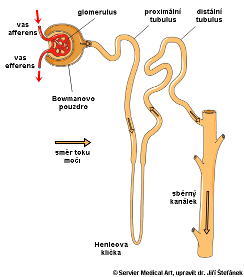

# Ledviny (renes, nefros)

- párový orgán fazolovitého tvaru - retroperitoneálně
- cca 150g

## Význam

- udržení homeostázy
- zbavování se odpadních látek - močovina
- osmoregulace - poměr vody a solí v těle

## Stavba

- **Makroskopicky:** kůra, dřeň, pánvička
  - kůra ledviny - glomuruly, zrnitý
  - dřeň ledviny - pyramidy, H. kličky
- **Mikroskopicky:** nefron

### Nefron

= základní jednotka ledvin

- denně projde ledvinami 1500 l krve

#### Stavba nefronu

- Malpighiho tělísko
  - glomerulus
  - Bowmanovo pouzdro/váček
- proximální kanálek
- Henleova klička
- distální tubulus
- sběrný kanálek

##### Stavba malpighiho tělíska

- **Glomerulus** - vlásečnicce, klubíčko cca 30 kapilár, jemné póry
  - **glomerulární filtrace** = ultrafiltrace plazmy selektivná filtrace
- **Bowmanovo pouzdro** - primární moč (150l denně)
- **Tubulární resorpce** = zpětné vstřebání vody a dalších látek z primární moči zpět do krve, nejvíce v proximálním tubulu
- **Proximální tubulus** - zpětné 100% vstřebání glukózy a aminokyselin, 67% vody, + ionty ($Na^+$,$Cl^-$, $HCO_3$), močovina
  - bezprahové léky - kreatinin, inulin - nepropustné zpět
- **Henleova klička** - zpětné vstřebání vody, zahušťování vody, zahušťování moči
- **Distální tubus** - vstřebávání iontů a vody, reaguje na hormony, vyloučení

###### Definitivní moč

- 1,5 l definitivní moči denně
- vstřebávání v kanálcích 99 % vody z primární moči
- **obsah:** močovina, vody, NaCl, další soli, barviva, léky, odpadní látky
- neměla by být přítomna glukóza a proteiny

###### Zdravý glomerulus

**Prochází:**

- voda
- močovina, kreatinin, kyselina močová
- ionty $Na^+, K^+, Ca^{2+}, HCO_3^-$
- glukóza, aminokyseliny
- vitaminy, hormony, léky navázané v těle na bílkoviny

**Neprochází:**

- krevní buňky - erytrocyty, leukocyty, trombocyty
- velké proteiny - albumin

## Hormonální regulace tvorby moči

### Antidiuretický hormon

- ADH, vasopresin
- z hypotalamu (neurohypofýza)
- zvyšuje zpětné vstřebávání vody z kanálků do krve
- vyplavuje se při nízkém tlaku, při dehydrataci
- zastavení tvorby při nadbytku tekutin
- nedostatek -> žiznivka (diabetes insipidus)

### Natriuretický peptid

- ze srdce (při vyšším napští síní), antagonista aldosteronu -> zvyšuje objem moči

### Aldosteron

- z kůry nadledvin
- zvyšuje zpětné vstřebávání $Na^+$ z ledvinných kanálků do krve
- spouští se při vyplavení reninu z ledvin (pokles tlaku, málo $Na^+$)

### Kortizol

## Nervové řízení

- centrum mikce (močení)
  - v bederní míše
