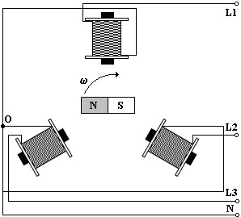
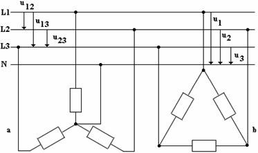

# Střídavý proud v energetice

## Jednofázový generátor AC

- otáčející se závit/cívka v homogenním magnetickém poli

## Třífázový generátor AC

- 3 cívky (L1-3) - stator (v klidu)
  - indukuje se zde AC napětí
- elektromagnet - rotor (otáčí se)
  - obsahuje generátor DC napětí (dynamo) - BUDIČ

$$u_1(t) = U_m \cdot \sin{(\omega t)}$$
$$u_2(t) = U_m \cdot \sin{(\omega t - \frac{2 \pi}{3})}$$
$$u_3(t) = U_m \cdot \sin{(\omega t - \frac{4 \pi}{3})}$$

$$f = 3000 \, ot/min = 50 \, Hz$$
efektivní hodnota: $U = 230 \, V$
$$U_m = \sqrt{2} \cdot U \doteq 325 \, V$$

$$\vec{U_{23}} = \vec{U_2} + \vec{U_3}$$
$$|\vec{U_{1}}| = |\vec{U_{23s}}|$$
$$\vec{U_{1}} + \vec{U_{23}} = \vec{0}$$

## Třífázová soustava AC

N - nulovací vodič (zelený)  
L1, L2, L3 - fáze (červená, hnědá, modrá)  

$U_1,U_2,U_3 \, (L_1 \div L_3 / N)$ – fázová napětí o efektivní hodnotě 230 V
$$U_m = 230 \cdot \sqrt{2} \doteq 325 \, V$$

$U_{12},U_{23},U_{13}$ – sdružená napětí
$$U_{12} = U \cdot \sin{\omega t} - U \cdot \sin{\omega t - \frac{2}{3} \pi}$$
$$U_{12} = U \cdot 2 \sin{\frac{\omega t - \omega t + \frac{2}{3} \pi}{2}} \cos{\frac{\omega t + \omega t - \frac{2}{3} \pi}{2}}$$
$$U_{12} = U \cdot \sqrt{3} \cos{\omega t - \frac{2}{3}\pi}$$
$$U_{12}=U_{13}=U_{23}=\sqrt{3} \cdot U = \sqrt{3} \cdot 230 \doteq 400 \, V$$
