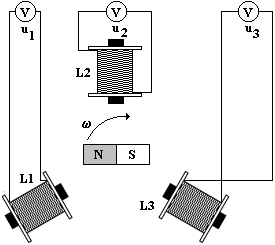
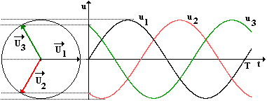

# Střídavý proud v energetice

## Jednofázový generátor AC

- otáčející se závit/cívka v homogenním magnetickém poli

## Třífázový generátor AC

- 3 cívky (L1-3) - stator (v klidu)
  - indukuje se zde AC napětí
- elektromagnet - rotor (otáčí se)
  - obsahuje generátor DC napětí (dynamo) - BUDIČ

$$u_1(t) = U_m \cdot \sin{(\omega t)}$$
$$u_2(t) = U_m \cdot \sin{(\omega t - \frac{2 \pi}{3})}$$
$$u_3(t) = U_m \cdot \sin{(\omega t - \frac{4 \pi}{3})}$$

$$f = 3000 \, ot/min = 50 \, Hz$$
efektivní hodnota: $U = 230 \, V$
$$U_m = \sqrt{2} \cdot U \doteq 325 \, V$$

$$\vec{U_{23}} = \vec{U_2} + \vec{U_3}$$
$$|\vec{U_{1}}| = |\vec{U_{23s}}|$$
$$\vec{U_{1}} + \vec{U_{23}} = \vec{0}$$

