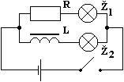

# Vlastní indukce

Dříve se rozsvítí žárovka u rezistoru, a teprve pak postupně žárovka u cívky s jádrem.

Vlastní indukce je vznik indukovaného elektrického pole ve vodiči, při změnách magnetického pole, které vytváří proud procházející vodičem.

Je opačně orientováno než vnější elektrické pole zdroje.
